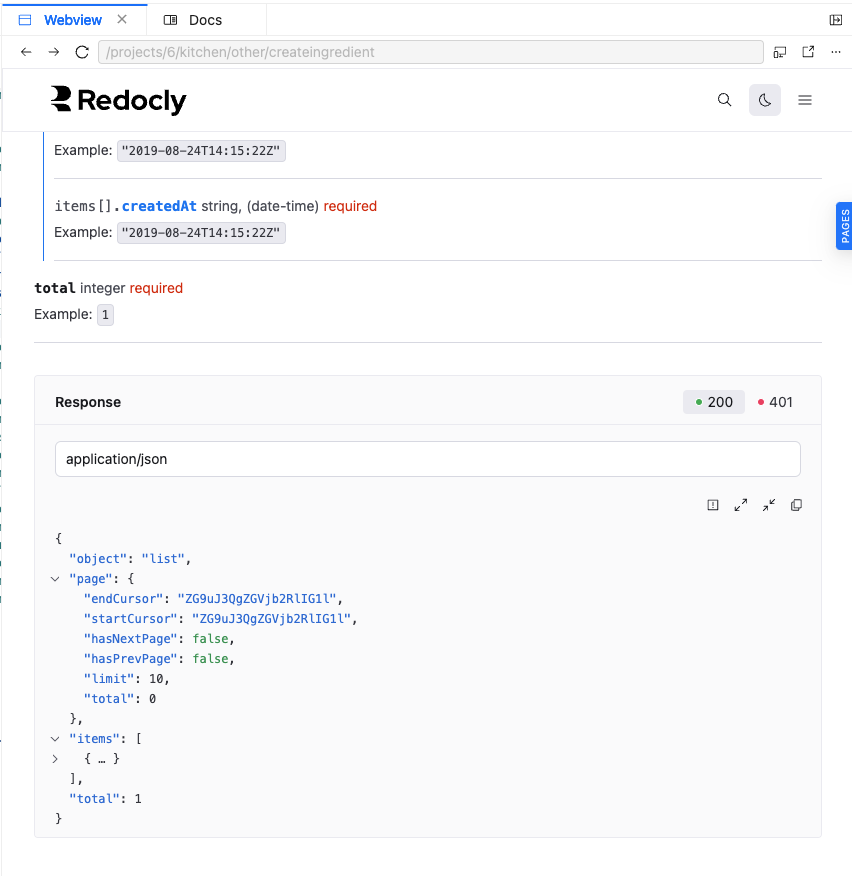

# What made you smile?
It was easy to add an API definition and test it using Replay.

# What did you find confusing?

When I clicked to change the response status, the content changed. It’s very inconvenient because it can cause a significant shift that alters the whole view, making me lose my place and forcing me to find the example again.

1. The view before i clicked on `401`
 

1. The view after (The content I need is located far at the top because the amount of content for this error is much smaller, and this caused a significant shift)

