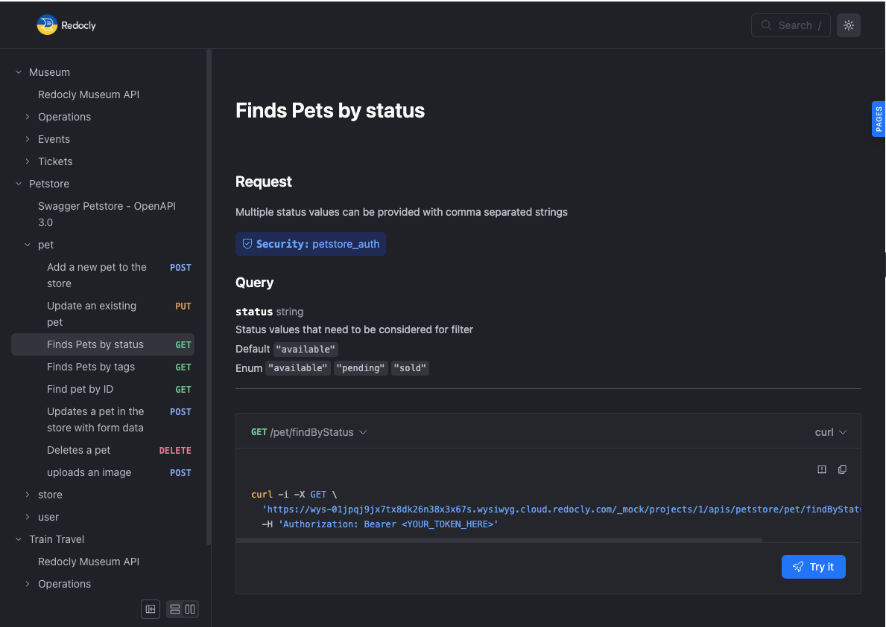


# Why We Created This Information Architecture

## Comparing Different Approaches
xxx
When designing our website, we considered three different approaches for displaying our products:

### Option 1: Single Sidebar

The sidebar approach keeps all navigation options visible at all times, making it easy for users to jump between products. However, it takes up horizontal space and can become cluttered with too many options.

### Option 2: Navbar

The navbar approach keeps navigation at the top of the page, which is a familiar pattern for many users. It works well for a limited number of items but can become unwieldy with dropdown menus for many products.

### Option 3: Catalog

The catalog approach presents products in a grid or list view, allowing users to visually scan and compare options. It scales well for many products and provides more space for product information and imagery.

## Why We Chose the Catalog Approach

After evaluating all three options, we selected the catalog approach for the following reasons:

1. **Scalability**: The catalog can easily accommodate our growing product line without redesigning the navigation.
2. **Visual Comparison**: Users can see multiple products at once, making comparison shopping easier.
3. **Mobile Responsiveness**: The catalog layout adapts well to different screen sizes.
4. **Conversion Optimization**: Showcasing product images and key details in the catalog view has been shown to increase engagement and conversion rates.

We found that for our specific mix of products, the visual nature of the catalog approach creates a better shopping experience while maintaining clear organization of our offerings. 